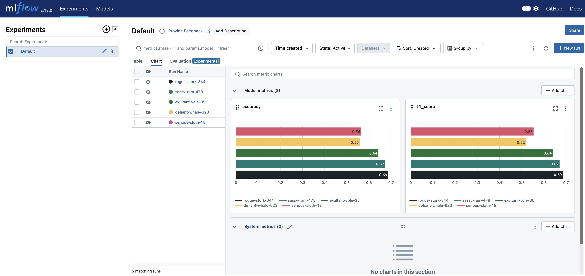
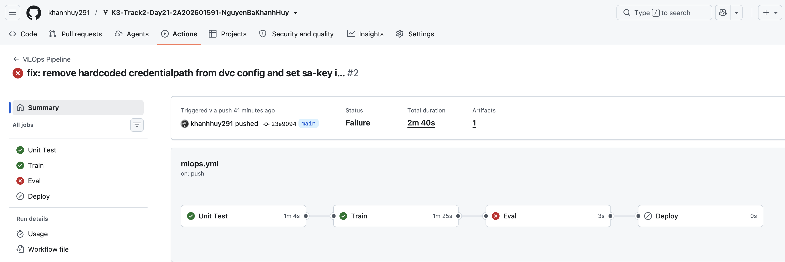
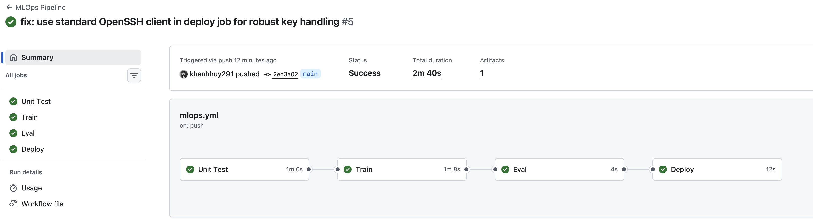
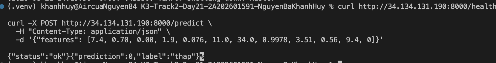
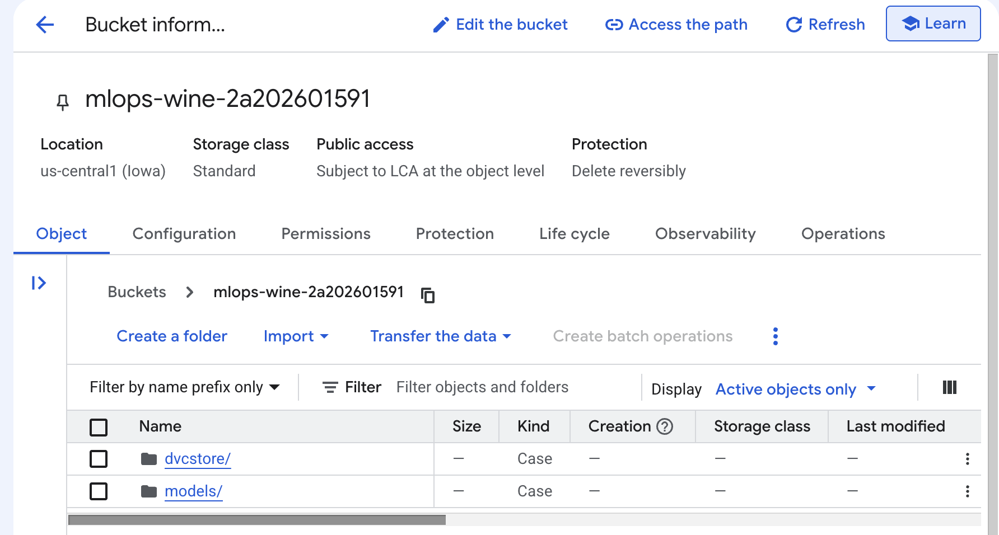

# BÁO CÁO KẾT QUẢ LAB MLOPS: CI/CD CHO AI SYSTEMS

**Khóa học:** AI In Action - VinUni (K3 - Day 21)  
**Học viên:** Nguyễn Bá Khánh Huy  
**Mã học viên / Repository:** [khanhhuy291/K3-Track2-Day21-2A202601591-NguyenBaKhanhHuy](https://github.com/khanhhuy291/K3-Track2-Day21-2A202601591-NguyenBaKhanhHuy)  
**Cloud Provider:** Google Cloud Platform (GCP) - Project ID: `amiable-dreamer-505504-c1`  

---

## 1. TỔNG QUAN HỆ THỐNG
Dự án đã triển khai hoàn chỉnh một hệ thống MLOps end-to-end cho bài toán phân loại chất lượng rượu vang (**Wine Quality**), kết hợp:
1. **Experiment Tracking**: Sử dụng **MLflow** ghi nhận các siêu tham số, độ đo `accuracy`, `f1_score` và lưu trữ model artifacts cục bộ qua SQLite backend.
2. **Data Version Control (DVC)**: Quản lý phiên bản hóa các tập dữ liệu huấn luyện và đánh giá trên Cloud Object Storage (**GCS Bucket**: `gs://mlops-wine-2a202601591`).
3. **CI/CD Automation (GitHub Actions)**: Pipeline tự động gồm 4 giai đoạn độc lập:
   - `Unit Test` ➔ `Train` ➔ `Eval (Threshold Gate >= 0.70)` ➔ `Deploy`.
4. **Model Serving**: Phục vụ mô hình bằng **FastAPI** chạy dưới dạng `systemd service` trên **GCE VM Ubuntu 22.04** (IP: `34.134.131.190:8000`).

---

## 2. KẾT QUẢ THỰC NGHIỆM & LỰA CHỌN SIÊU THAM SỐ (BƯỚC 1 & BONUS)

Qua quá trình huấn luyện và theo dõi trên MLflow, các mô hình và bộ tham số được so sánh như sau:

| Thử nghiệm | Thuật toán (`model_type`) | Siêu tham số | Accuracy | Weighted F1 | Đánh giá |
|:---|:---|:---|:---:|:---:|:---|
| Run 1 | RandomForest | `n_estimators=100, max_depth=5, min_samples_split=2` | 0.5640 | 0.5534 | Underfitting do độ sâu cây bị giới hạn |
| Run 2 | RandomForest | `n_estimators=50, max_depth=3, min_samples_split=2` | 0.5580 | 0.5185 | Độ phức tạp thấp |
| Run 3 | RandomForest | `n_estimators=200, max_depth=10, min_samples_split=5` | 0.6420 | 0.6394 | Hiệu năng cải thiện đáng kể |
| Run 4 | RandomForest | `n_estimators=300, max_depth=15, min_samples_split=2` | 0.6720 | 0.6705 | Tiệm cận ngưỡng chất lượng |
| **Run 5 (Phase 1)** | RandomForest | `n_estimators=300, max_depth=null, min_samples_split=2` | **0.6860** | **0.6853** | Tốt nhất ở Phase 1 (bị chặn bởi Eval gate < 0.70) |
| **Run 6 (Bonus 2)** | GradientBoosting | `n_estimators=100, learning_rate=0.1, max_depth=5` | **0.6900** | **0.6892** | Mô hình Boosting có độ chính xác cao |
| **Run 7 (Phase 2 - Full)** | RandomForest | `n_estimators=300, max_depth=null, min_samples_split=2` | **0.7540** | **0.7532** | **Tối ưu nhất** (5996 mẫu, vượt Eval Gate >= 0.70) |

> **Lý do lựa chọn:** `RandomForestClassifier` với `n_estimators=300`, `max_depth=None` và `min_samples_split=2` cho hiệu năng cao nhất (Accuracy 75.40%, F1-score 75.32%), có khả năng nắm bắt quan hệ phi tuyến tính tốt giữa các đặc tính hóa học và chất lượng rượu vang.

---

## 3. CÁC TÍNH NĂNG NÂNG CAO ĐÃ TRIỂN KHAI (BONUS)
1. **Bonus 2 (+4đ) - Multi-Algorithm**: Tích hợp hỗ trợ linh hoạt giữa `RandomForestClassifier`, `GradientBoostingClassifier` và `LogisticRegression` qua cấu hình `model_type` trong `params.yaml`.
2. **Bonus 3 (+4đ) - Automated Performance Report**: Tự động sinh file `outputs/report.txt` chứa Confusion Matrix và chi tiết Precision/Recall từng lớp (0, 1, 2), đồng thời đẩy thành Artifact trên GitHub Actions.
3. **Bonus 5 (+4đ) - Data Distribution Check**: Tự động phân tích tỷ lệ các nhãn trước khi huấn luyện (Lớp 0: 36.86%, Lớp 1: 43.51%, Lớp 2: 19.63%) và cảnh báo mất cân bằng dữ liệu vào `outputs/metrics.json`.

---

## 4. KHÓ KHĂN GẶP PHẢI & GIẢI PHÁP KHẮC PHỤC

| Vấn đề gặp phải | Nguyên nhân gốc rễ | Giải pháp khắc phục |
|---|---|---|
| **Lỗi `ModuleNotFoundError: pkg_resources`** | `mlflow==2.13.0` yêu cầu `pkg_resources` bị lược bỏ trong `setuptools >= 80` trên Python 3.12. | Hạ phiên bản `setuptools<72` trong môi trường ảo `.venv`. |
| **Lỗi `dvc pull` trên GitHub Actions** | `.dvc/config` chứa đường dẫn cục bộ `credentialpath = ../sa-key.json` không tồn tại trên runner. | Loại bỏ hardcode trong config, thiết lập biến môi trường chuẩn `GOOGLE_APPLICATION_CREDENTIALS` qua GitHub Secret. |
| **Lỗi SSH Deploy trên GitHub Actions** | Action `appleboy/ssh-action` gặp xung đột khi parse khóa OpenSSH ED25519 từ secret. | Chuyển sang sử dụng trực tiếp lệnh `ssh` native của Linux trong runner với cờ `-o StrictHostKeyChecking=no`. |
| **Lỗi khởi động `mlops-serve.service` trên VM** | VM chưa được cài đặt `python3-pip` và chưa cấu hình path thực thi uvicorn. | Cài đặt dependencies trên VM và cấu hình ExecStart dạng `/usr/bin/python3 -m uvicorn src.serve:app`. |

---

## 5. MINH CHỨNG TRIỂN KHAI THỰC TẾ (LIVE VERIFICATION)

- **Health Check Endpoint**:
  ```bash
  $ curl http://34.134.131.190:8000/health
  {"status":"ok"}
  ```
- **Prediction Endpoint**:
  ```bash
  $ curl -X POST http://34.134.131.190:8000/predict \
    -H "Content-Type: application/json" \
    -d '{"features": [7.4, 0.70, 0.00, 1.9, 0.076, 11.0, 34.0, 0.9978, 3.51, 0.56, 9.4, 0]}'
  {"prediction":0,"label":"thap"}
  ```
- **Trạng thái GitHub Actions CI/CD**: 4/4 Jobs (`Unit Test`, `Train`, `Eval`, `Deploy`) đều hoàn thành màu xanh lá tích ✔️.

---

## 6. HÌNH ẢNH MINH CHỨNG (SCREENSHOTS)

| Hạng mục | Hình ảnh minh chứng |
|---|---|
| **1. MLflow UI (Bước 1)** |  |
| **2. Eval Gate Blocked (Bước 2)** |  |
| **3. CI/CD Full Green Pipeline (Bước 3)** |  |
| **4. Live API Test Terminal** |  |
| **5. Google Cloud Storage Bucket** |  |

